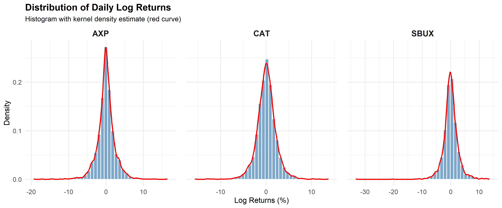
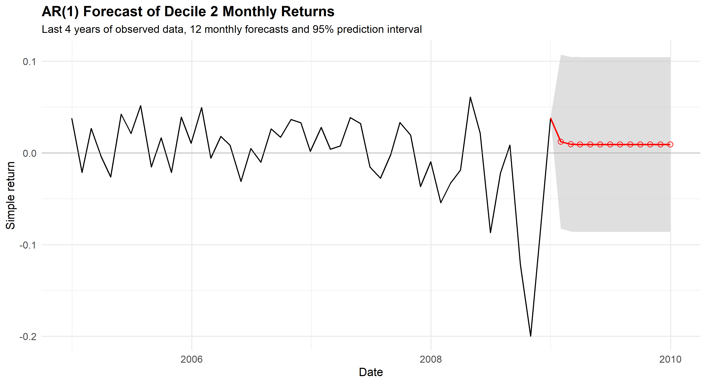
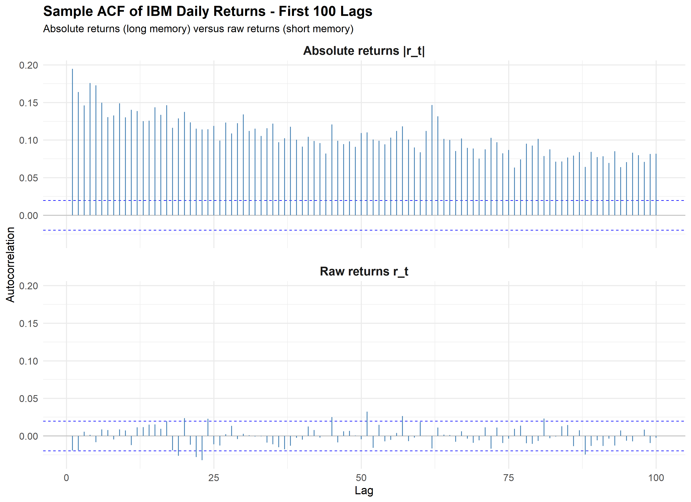
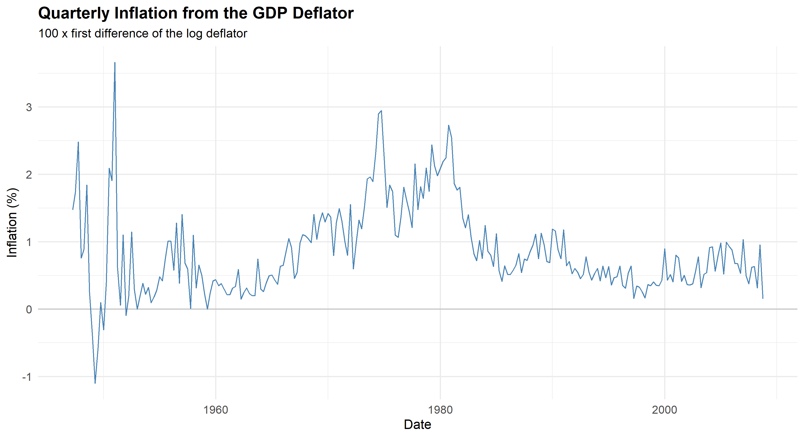
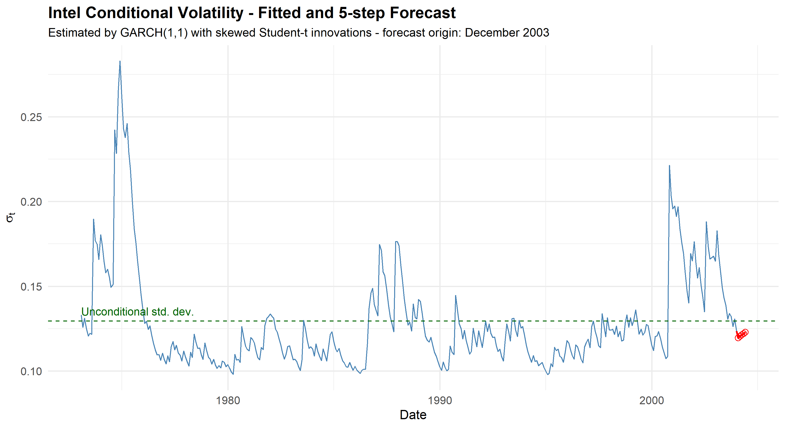
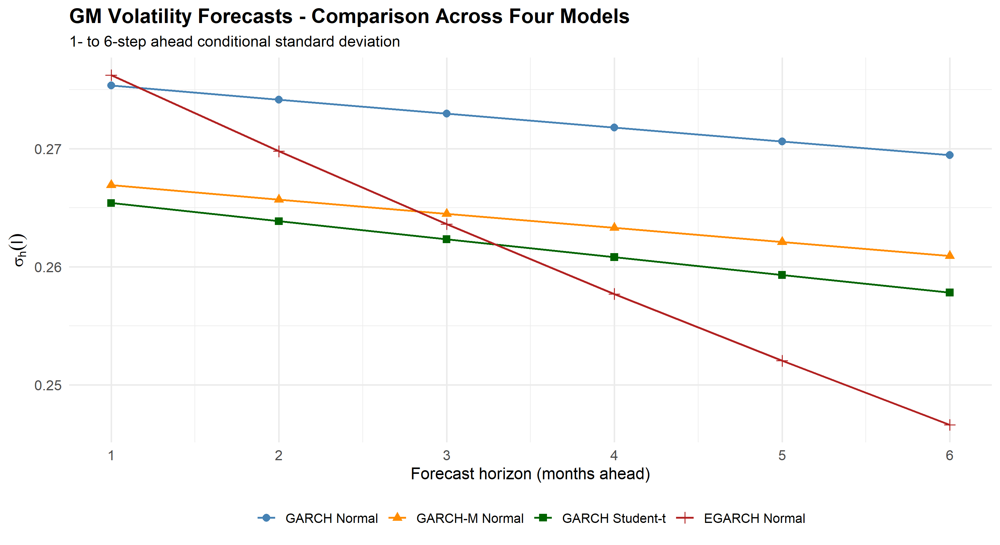
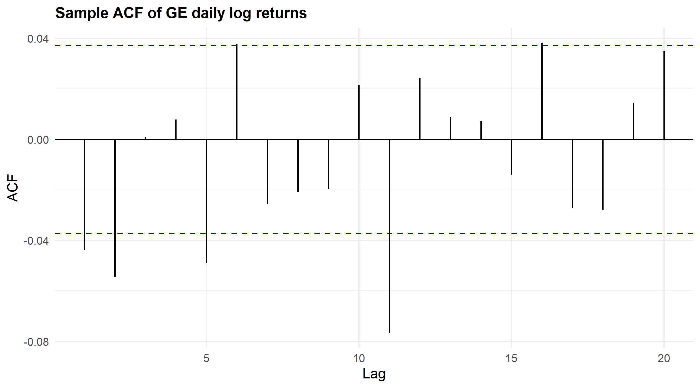
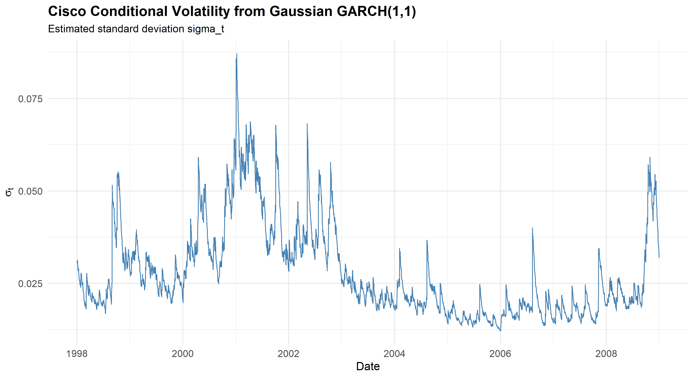

# Financial Time-Series Econometrics in R

This is my individual **Topics in Econometrics** coursework, cleaned up for GitHub without changing the underlying assignment. It contains 20 exercises on returns, ARMA/ARIMA models, conditional volatility and market tail risk.

I kept the submitted figures and model choices, but I also documented several issues found during a later review. Those corrections are listed in [`AUDIT.md`](AUDIT.md) rather than being silently folded into the original results.

## Coverage

| Block | Exercises | Main topics |
|---|---:|---|
| Returns and distributions | 5 | simple/log returns, moments, hypothesis tests, densities |
| ARMA / ARIMA | 7 | ACF/PACF, Ljung-Box, forecasting, unit roots, ARIMA |
| ARCH / GARCH | 6 | ARCH-LM, ARCH, ARCH-M, GARCH, GARCH-M, EGARCH, volatility forecasts |
| VaR / Expected Shortfall | 2 | Gaussian and Student-t GARCH, multi-step approximation, residual diagnostics |

The datasets used in the exercises cover equities, CRSP portfolios and indices, FX rates, Moody's corporate yields and the US GDP implicit price deflator. The original third-party workbooks are not redistributed.

## A few examples

<table><tr>
<td width="50%" valign="top"><strong>Daily equity return distributions</strong><br></td>
<td width="50%" valign="top"><strong>Decile 2 AR(1) forecast</strong><br></td>
</tr></table>

<table><tr>
<td width="50%" valign="top"><strong>IBM absolute-return persistence</strong><br></td>
<td width="50%" valign="top"><strong>GDP-deflator inflation</strong><br></td>
</tr></table>

<table><tr>
<td width="50%" valign="top"><strong>Intel GARCH volatility forecast</strong><br></td>
<td width="50%" valign="top"><strong>GM volatility-model comparison</strong><br></td>
</tr></table>

<table><tr>
<td width="50%" valign="top"><strong>GE return ACF</strong><br></td>
<td width="50%" valign="top"><strong>Cisco conditional volatility</strong><br></td>
</tr></table>

The complete archive contains **41 submitted PNG outputs**. I compared the coursework PNGs with the raster images embedded in the submitted PDF; all 41 matched at the decoded-pixel level. See [`figures/README.md`](figures/README.md) for the full index.

## Repository layout

```text
R/
├── chapter_01_returns/      # 5 scripts
├── chapter_02_arma_arima/   # 7 scripts
├── chapter_03_arch_garch/   # 6 scripts
├── chapter_07_var/          # 2 scripts
└── utils.R

figures/                     # 41 submitted PNG outputs
results/                     # audited machine-readable outputs
data/README.md               # required input files and data policy
requirements.R
AUDIT.md
```

## Running the code

Place the original exercise workbooks in `data/raw/` with the filenames listed in [`data/README.md`](data/README.md), then run from the repository root:

```r
source("requirements.R")
source("R/chapter_03_arch_garch/exercise3_6.R")
```

The scripts write figures and result tables to the matching chapter folders.

## Important audit points

The main corrections are not cosmetic:

- Exercise 1.5 reports **standard deviation**, as requested by the exercise, rather than the variance relabelling in the submitted report.
- The Intel workbook supplied for Exercise 3.3 ends in **December 2003**, despite the exercise text naming 2008; the public code does not invent the missing years.
- The Chapter 7 Student-t VaR/ES code uses the **standardized Student-t** convention consistent with `fGarch::garchFit(..., cond.dist = "std")`.
- GE's fitted `alpha + beta > 1` is not called a formally estimated IGARCH model.
- The 15-day GE calculation is labelled as the coursework aggregation approximation, not as an exact multi-period GARCH loss distribution.

See [`AUDIT.md`](AUDIT.md) for the full list, including the higher-order GARCH forecast-recursion note.

## Authorship

This was an **individual** assignment completed for Topics in Econometrics in the 2025/2026 academic year.

Academic coursework on historical data; not a live trading or production risk system.
